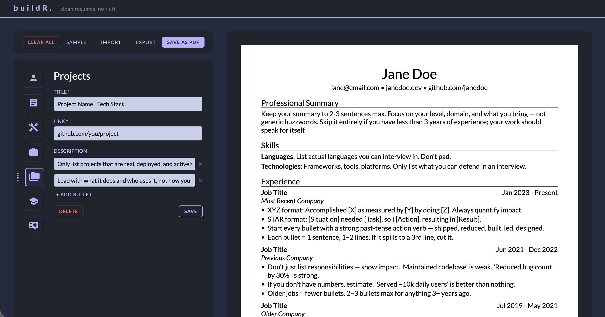

# buildR.



<h4>
    <a href="https://cv-buildr.vercel.app/" target="_blank">
        buildR. | Live Demo 🛠️
    </a>
</h4>

**buildR.** is a clean, minimal resume builder that runs entirely in the browser. Fill in your details, reorder sections to your preference, and export a print-ready A4 PDF — no sign-up, no backend, no formatting headaches.

## Tech Stack

[](#)
[](#)
[](#)
[](#)

## Motivation

Many engineers struggle with resumes not because of lack of experience, but because of poor structure and formatting.

The [r/EngineeringResumes](https://www.reddit.com/r/EngineeringResumes/wiki/index/) wiki consistently highlights what actually gets interviews — clean single-column layouts, strong bullet points, strict one-page discipline. A widely-used template from that community became the visual and structural reference for buildR.

The goal was to take that proven format and make it accessible without LaTeX knowledge, manual tweaking, or paid tools.

## Features

- **Live preview** — changes reflect instantly on the A4 page
- **Section-based editor** — each resume section has a dedicated form
- **Drag-and-drop reordering** — arrange sections in any order via the sidebar
- **Bullet point editor** — add, edit, and remove individual bullet points per entry
- **Strict A4 format** — enforces single-page discipline by design
- **Export to PDF** — print-ready output via the browser's native print dialog
- **Local persistence** — resume data is saved to localStorage automatically

## Limitations

- Desktop only — no mobile layout
- Single page — content that exceeds A4 height is clipped by design
- No cloud sync — data lives in localStorage only

## Local Development

```bash
git clone https://github.com/chaibrews/buildr
cd buildr
npm install
npm run dev
```
